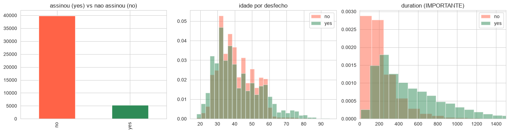
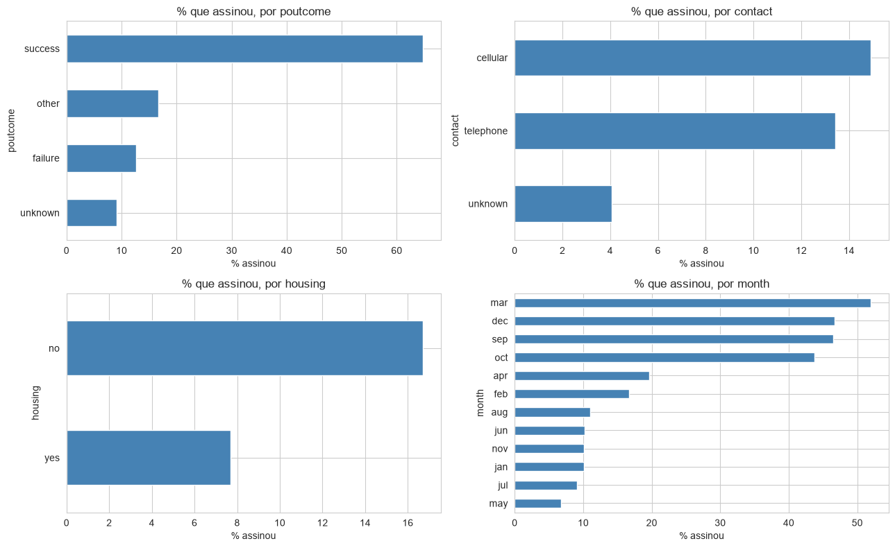
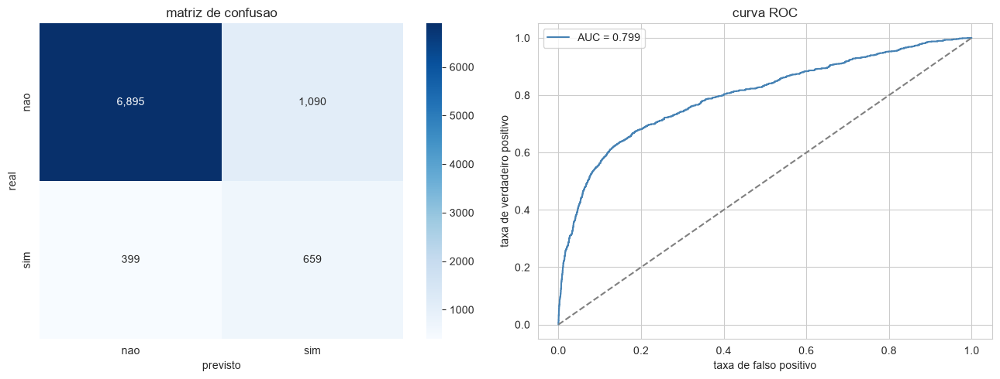
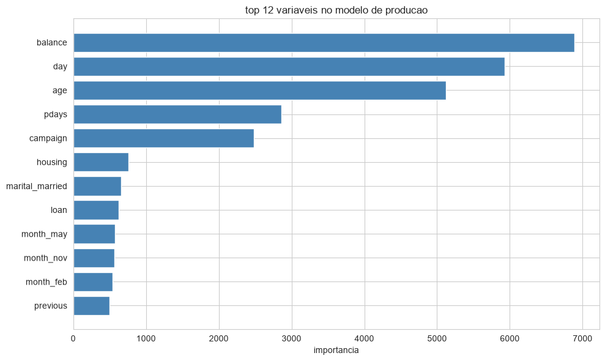

# Bank Marketing Prediction

Um banco portugues rodava campanhas de telemarketing para vender depositos a prazo. Ligavam para cliente apos cliente, sem muito criterio de quem priorizar. A pergunta natural surgiu: da para prever, antes de discar, quais clientes tem mais chance de dizer sim?

Este projeto e uma tentativa honesta de responder isso com dados.

---

## O dataset

Os dados vem diretamente do [UCI Machine Learning Repository](https://archive.ics.uci.edu/dataset/222/bank+marketing), um dos datasets de marketing mais citados na literatura. Sao **45.211 registros** de campanhas reais de um banco portugues, com variaveis demograficas, financeiras e de comportamento em contatos anteriores.

A variavel alvo e a `y`: o cliente assinou o deposito a prazo ou nao.

Spoiler: so **11,7% assinou**. Isso ja diz bastante sobre o desafio.

---

## O que foi feito

A estrutura do trabalho seguiu tres fases claras.

**Exploracao.** Antes de qualquer modelo, entender o que os dados dizem. Distribuicao do alvo, variaveis com `unknown` disfarcado de dado faltando, e ja uma suspeita sobre a variavel `duration` que se confirmaria depois.

**Modelagem.** Tres algoritmos de arvore foram treinados e comparados: Random Forest, XGBoost e LightGBM. A metrica principal foi o ROC-AUC, porque acuracia nao serve para base desbalanceada: um modelo que chuta "ninguem assina" acerta 88% e e inutil.

**Correcao para producao.** O ponto mais importante do projeto. A variavel `duration` (duracao da ligacao em segundos) vaza informacao do futuro: voce so a conhece depois que a ligacao acabou, ou seja, depois que o resultado ja existe. Um modelo que usa ela parece otimo no papel e nao funciona na operacao real. O modelo final foi retreinado sem ela.

---

## A pegadinha da `duration`

Ligacoes longas convertem mais porque quem esta interessado fica na linha. Isso faz a `duration` ser altamente preditiva. Mas na hora de decidir para quem ligar, a duracao ainda nao existe.

```
AUC com duration (benchmark): 0.9323
AUC sem duration (producao):  0.8051
```

Essa queda de 13 pontos era informacao que vazava do futuro para o treinamento. O numero de producao e menor, mas e o numero verdadeiro.

---

## Graficos

### Distribuicao geral: alvo, idade e duration



A distribuicao de `duration` ja da a pista visual do problema: quem assinou ficou muito mais tempo na linha. Informacao real, mas inutilizavel antes da ligacao.

---

### Taxa de conversao por categoria



Quem ja tinha respondido bem a uma campanha anterior (`poutcome = success`) converte em uma taxa muito acima da media. Mes e canal de contato tambem mudam bastante o resultado. Essas variaveis estao disponiveis antes da ligacao, entao ficam no modelo de producao.

---

### Matriz de confusao e curva ROC



Resultado do LightGBM final, treinado sem `duration`. AUC de **0.8051** no conjunto de teste. O corte de decisao (0.5 por padrao) pode ser ajustado dependendo do custo de uma ligacao versus o valor de um deposito fechado.

---

### Variaveis que mais pesam



`balance` (saldo medio anual), `day` (dia do contato) e `age` lideram a importancia no modelo sem vazamento. Sao variaveis que o banco conhece antes de discar.

---

## Modelos e resultados

| Modelo | AUC | Recall | F1 |
|---|---|---|---|
| LightGBM (benchmark com duration) | 0.9323 | 0.8611 | 0.5986 |
| XGBoost (benchmark com duration) | 0.9289 | 0.8138 | 0.6100 |
| Random Forest (benchmark com duration) | 0.9277 | 0.8374 | 0.5854 |
| **LightGBM (producao, sem duration)** | **0.8051** | | |

O modelo recomendado para uso real e o LightGBM sem `duration`, com hiperparametros ajustados via `RandomizedSearchCV` com validacao cruzada estratificada.

---

## MLflow

Cada run do experimento foi registrado no MLflow com parametros e metricas. Isso permite comparar versoes, reproduzir qualquer experimento anterior e saber exatamente qual modelo estava no ar em cada momento.


No **Databricks**, o MLflow esta integrado nativamente na plataforma. Os runs aparecem automaticamente na UI de experimentos sem configuracao extra, e o modelo pode ser registrado no Model Registry com uma linha de codigo.

Rodando **localmente**, os experimentos ficam gravados na pasta `mlruns/` do projeto. Para abrir a interface:

```bash
mlflow ui
```

Acesse `http://localhost:5000` e todos os runs ficam visiveis com parametros, metricas e artefatos. A pasta `mlruns/` esta no `.gitignore` justamente para nao versionar esses artefatos locais.

---

## Databricks

O notebook foi desenhado para funcionar nos dois ambientes sem mudanca de codigo.

No **Databricks**, a celula de carga detecta o contexto Spark e le os dados direto de uma tabela no Unity Catalog. O MLflow nativo registra cada experimento automaticamente. A escala horizontal do cluster lida com volumes maiores sem esforco.

No **VSCode local**, a mesma celula cai graciosamente para leitura do CSV. O desenvolvimento e rapido, e quando o codigo esta maduro, sobe para o Databricks sem ajuste.

Isso torna o fluxo natural: prototipa local, valida no cluster.

---

## Como rodar

Clone o repositorio e instale as dependencias:

```bash
pip install pandas numpy matplotlib seaborn scikit-learn xgboost lightgbm mlflow
```

Baixe o dataset no link do UCI acima e ajuste o caminho do CSV na celula de carga. Depois e so rodar o notebook celula a celula. A ordem importa, mas cada secao tem comentario explicando o raciocinio por tras da decisao.

---

## Conclusao para o negocio

O modelo entrega uma probabilidade de conversao para cada cliente antes do contato. Com isso, o time comercial ordena a lista do mais provavel para o menos provavel e liga de cima para baixo ate onde a capacidade do mes permitir.

Isso troca "liga para todo mundo" por "liga primeiro para quem tem mais chance". Simples assim, e e exatamente o que uma campanha bem calibrada deveria fazer.
